# Project 3 - HUBL

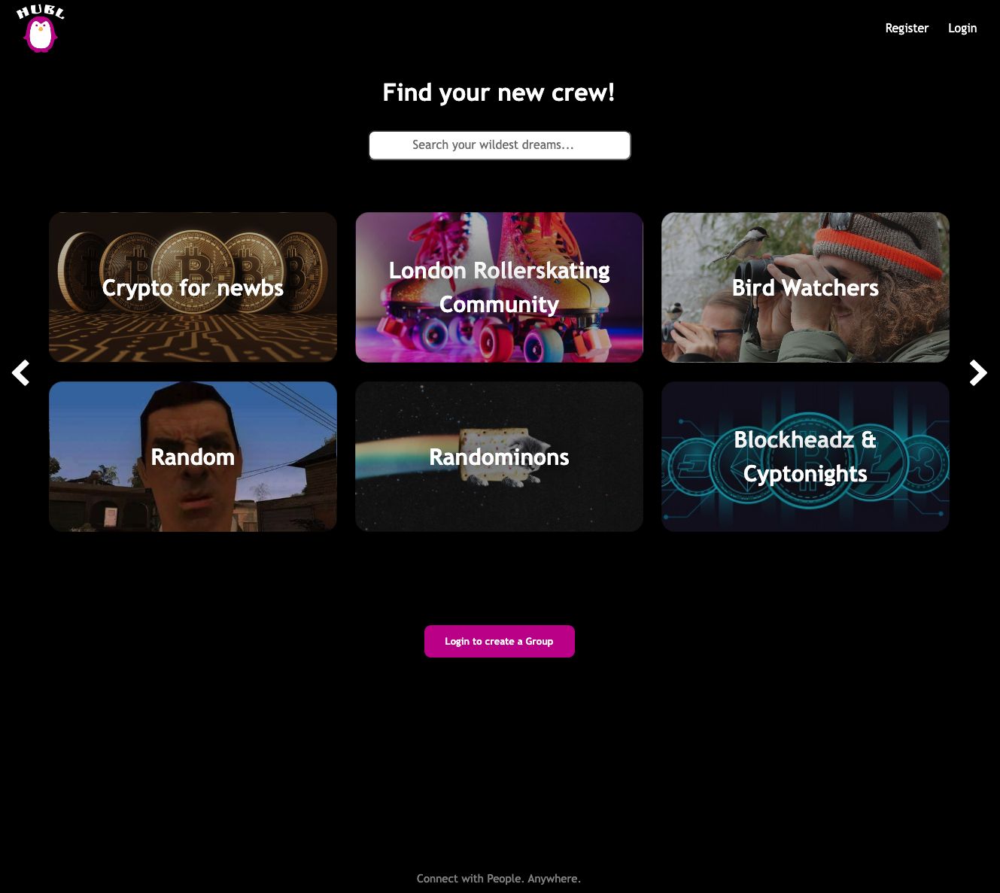

 
<h2>Description</h2>

HUBL is a social platform designed to bring people with similar interests together. Users are able to search for topics they might be interested in and read through the group’s posts and comments. The website also offers account registration which opens up the possibility for the users to create their own groups, write posts inside groups and comment on posts. Furthermore, every user has their own profile page, which allows them to edit their user details such as profile picture and their bio.

 
<h2>Deployment link</h2>

The App was deployed on Heroku and can be found <a href="https://hubl.herokuapp.com/"> here</a>. 

 
<h2>Getting Started/Code Installation</h2>

As well as the code on <a href="https://github.com/a-ullmann/hubl"> my GitHub page</a>.

 
<h2>Timeframe & Working Team</h2>

The project was finished within 7 days by a total of two people. It was a pleasure working with <a href="https://github.com/nattyhawkins"> Natalie Hawkins</a>.

 
<h2>Technologies Used</h2>

<ul>
  <li>MongoDB</li>
  <li>Express.js</li>
  <li>React.js</li>
  <li>Node.js</li>
  <li>JavaScript</li>
  <li>JWT</li>
  <li>Axios</li>
  <li>Bcrypt</li>
  <li>Git + GitHub</li>
  <li>BootStrap</li>
  <li>Cloudinary</li>
  <li>Excalidraw.com</li>
  <li>Slack</li>
  <li>Trello</li>
</ul>

 
<h2>Brief</h2>

<ul>
  <li>Build a full-stack application by making your own backend and your own front-end.</li>
  <li>Use an Express API to serve your data from a Mongo database.</li>
  <li>Consume your API with a separate front-end built with React.</li>
  <li>Be a complete product which most likely means multiple relationships and CRUD functionality for at least a couple of models.</li>
  <li>Implement thoughtful user stories/wireframes that are significant enough to help you know which features are core MVP and which you can cut.</li>
  <li>Have a visually impressive design to kick your portfolio up a notch and have something to wow future clients & employers. </li>
  <li>Be deployed online so it's publicly accessible.</li>
</ul>

 
<h2>Planning</h2>

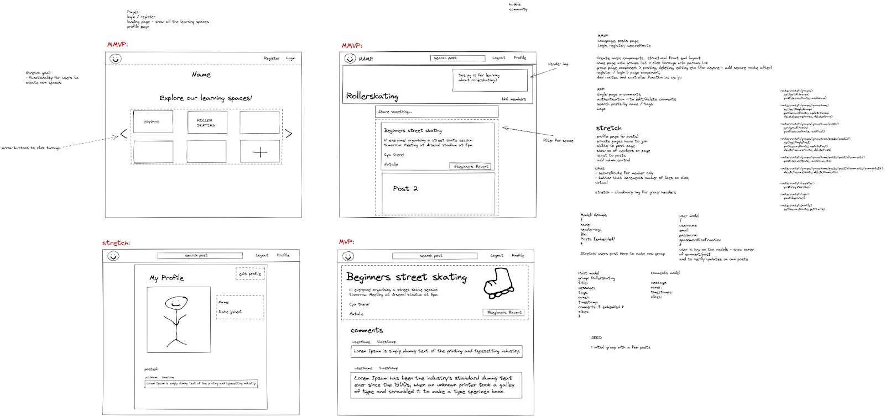

Similar to my previous projects, our team used Excalidraw to wireframe the basic pages we would want to achieve. We started off with the homepage which would consist of a header with the project logo, register and login buttons. On the main part we would have only 6 groups displayed with a functionality to click through more pages of groups. Next we created the wireframe of a group page, which consists of the group name itself and a description in the banner. Below we would display the individual posts and have the option to comment on them. Our stretch goal was to add a profile page for each user. 

During the project, we created a Trello board to keep track of things we needed to achieve, as well as fix certain bugs. Even though we both had our own tasks, we would stay in a Google-Hangout to keep the communication. By doing so, we were able to ask each other questions when one of us got stuck. This also allowed us to learn from each other quite effectively.

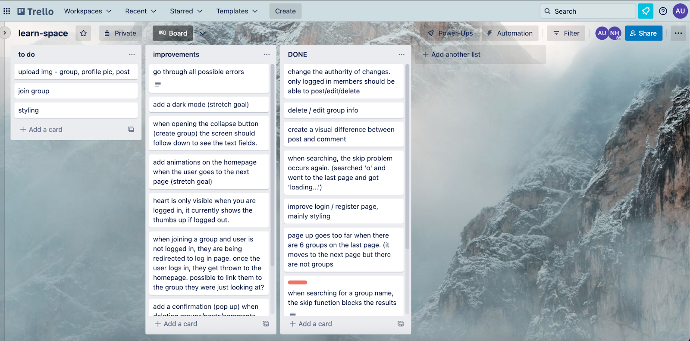

 
<h2>Build/Code Process</h2>

Our first steps in the build process was to create a working back-end. Here, we defined the group schema with Mongoose, which had a similar schema nested inside for individual posts. The post schema also had a comment schema nested inside. We used these schemas to seed our database. This was our core structure of our app. 

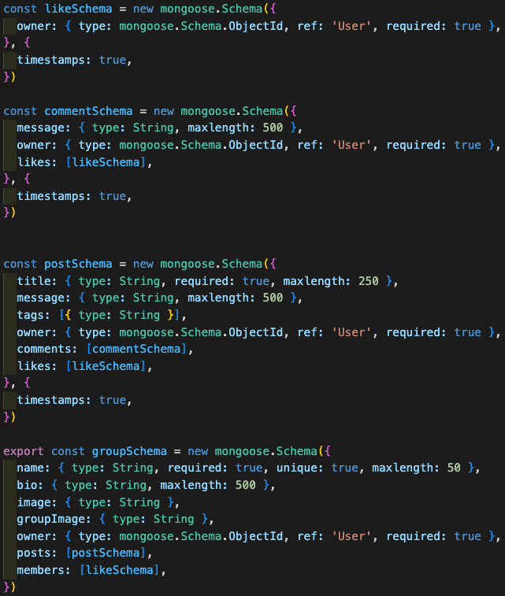

Next up was to create controllers for our back-end. An example of this is our “getAllGroups” function which we also used for our search function. The search function was part of my responsibility and turned out to be a challenge as we limited the groups to display only 6 at a time. This would influence the search function and only search out of those 6. To solve this, we added an if-statement that would check if something has been searched. If yes, it would take all groups and filter them based on the searched term. This would then go through a ternary that decides whether to map the names or return an empty array. Next, the “filter” variable checks the length of that array and saves either an object with the contents, or an empty object. The .find method takes this variable as an argument to find the desired group which would then get returned as a .json.

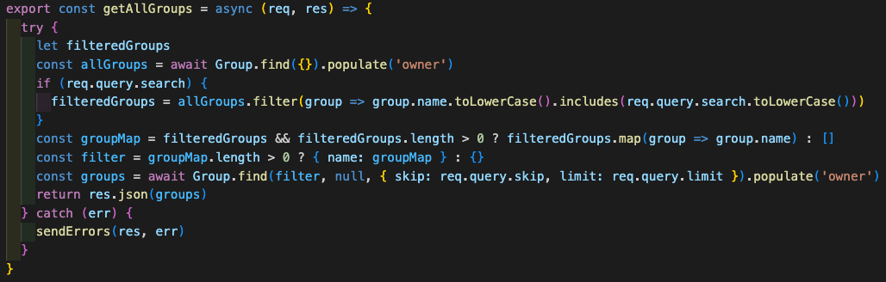

<h3>Authentication:</h3>
I was also eager to learn about the authentication on an App and therefore focused on creating the registration and login functionality. For that, a user schema had to be created, saving the essentials such as username, email, and password. Once created, I was able to build the authentication controllers, which can be seen below:

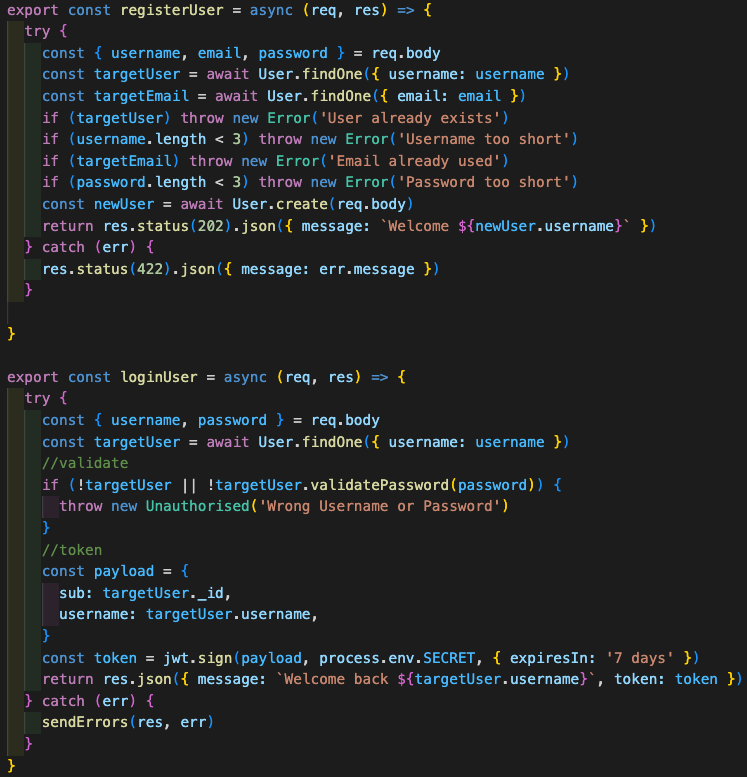

In these controllers, we were able to incorporate some error handling for better user experience. 

<h3>Homepage:</h3>
My main responsibility was to create the homepage of our app. Using Axios, we fetched our data from our database. As seen on the first useEffect from the screenshot below, we use skip and limit as parameters to only show 6 groups at a time. The user is able to press a button to flip through different pages of groups without reloading the page. 

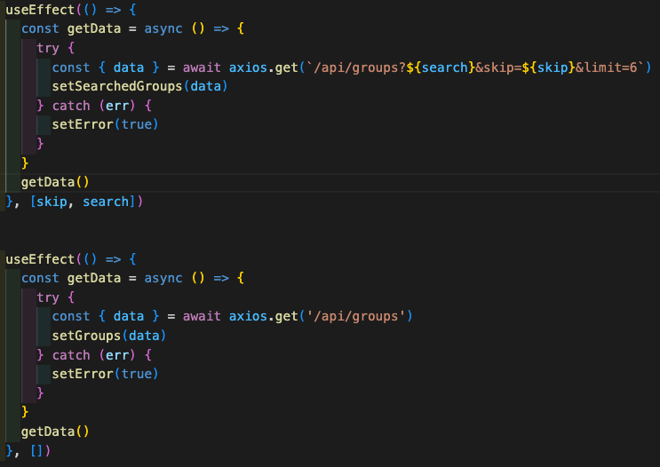

There are two buttons which act as a page up or page down function. 

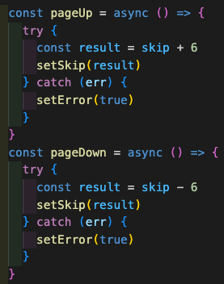

Additionally, one functionality that I added was an image upload using Cloudinary. 

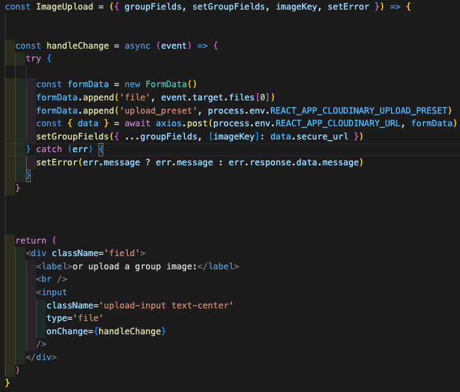

 
<h2>Challenges</h2>

One challenge included getting the navbar to update based on the user’s authentication status. The plan was to have “login” and “register” in the navbar when the user is not logged in, and when they are, it should change to “logout” and have a link to their “profile”. For that, we had to create a function that checks the user’s status as below: 

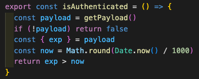

Next, we used this to create a ternary inside the return function of the navbar itself: 

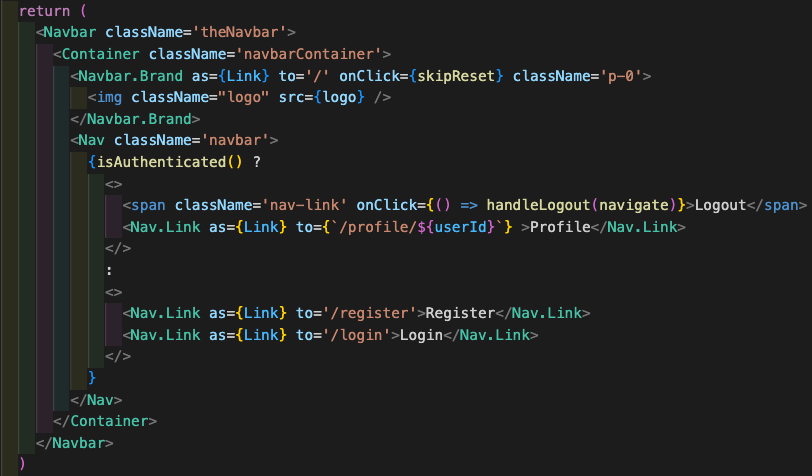

As mentioned earlier, it was difficult building the homepage to display only 6 groups at once and have the search function still search through all. 

Finally, it was also a challenge to create a proper plan for this project, as it was the first full-stack App that we were able to create. While working with my partner was very efficient, given the circumstances, I believe we could have made the process even more efficient by making a more in depth plan, prioritising the right topics and coming up with a styling plan much earlier, as this cost us a lot of time.  

 
<h2>Wins</h2>

Collaboration with my partner was definitely a win as we communicated properly, helped each other when needed and came to agreements rather quickly. It was also the first time using Git to merge our parts instead of using Live Share on VSCode. While it was difficult to grasp it in the beginning, we barely came across any problems. 

 
<h2>Key Learnings/Takeaways</h2>

I could feel getting better at planning out a project from scratch. Depending on the time limit, perhaps integrate less functionality but have it work more efficiently, and instead solve bugs that may show up. 

A key learning I was able to get from this opportunity was building a back-end and connecting it to the front-end as well as setting up my own APIs and making use of them by giving the user the ability to manipulate them. 

 
<h2>Bugs</h2>

When using the search bar with a term that does not exist in the group database, it shows all groups, regardless of name. An improvement here would be to show a message that the search term was not found. 

 
<h2>Future Improvements</h2>

When opening the “make your own group” button, the screen should automatically pull down, so that the user can see the form. It is currently difficult to notice. 

When joining a group and the user is not logged in, they are being redirected to the login page. Once the user logs in, they get thrown to the homepage and lose the group they were just on. An improvement here would be to redirect them back to the group they were looking at. 

Add a confirmation (pop up) when deleting groups/posts/comments. Currently, they just get deleted when pressing the button.

